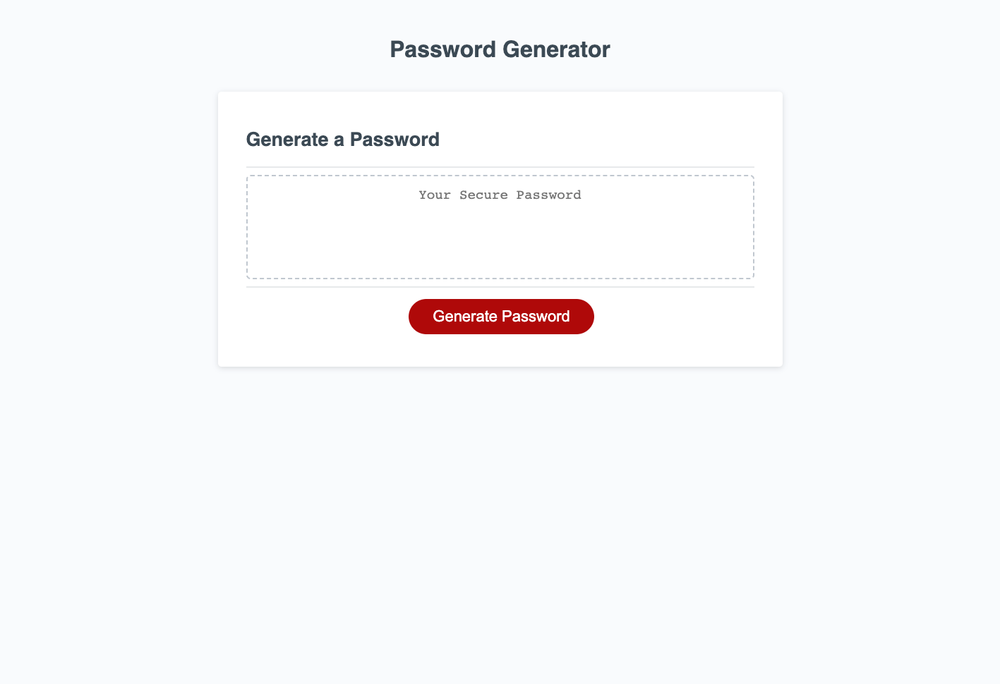

# password-generator

## Description

Password Generator is a web-based application which can be used to create complex passwords. The logic is structured in JavaScript code, and it uses multiple functions and if-statements to complete the job. The arrays allow you to include or exclude certain character types, or the user can select all of them to create a secure password. 

## Installation

N/A

## Usage

When the user clicks or taps on the **generate password** button, the user will be asked to enter a number between 8 and 128 to create a password. Next the user will be prompted whether they would like the password to contain lowercase letters, uppercase letters, special characters, and numbers. After the user makes their selections, the password generator application will use the logic provided in JavaScript to randomly choose from the selected options to create an individualized password. The user will be able to select the entire password and copy it into their clipboard to save the password.

## Screenshot

## Links

https://zbichsel.github.io/password-generator

https://www.github.com/zbichsel/password-generator

## Credits

N/A

## License

Please refer to the LICENSE in the repository.